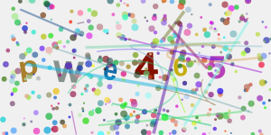

# @hqnseung/captcha.js

`@hqnseung/captcha.js`는 `canvas`를 이용한 간단한 캡차 이미지 생성 Node.js 라이브러리입니다. 

#### 캡차 이미지 예제: 


- a-z와 1-9로 구성된 무작위 글자 6자 생성
- 글자 기울기, 크기, 색상 무작위 생성
- 직선, 원, 곡선 등의 추가적인 잡음 요소 생성

<hr>

## 설치
```
npm install @hqnseung/captcha.js
```

## 예제

```js
const { generateCaptcha } = require('@hqnseung/captcha.js');
const fs = require('fs');

const { image, text } = generateCaptcha(); // 캡차 생성
console.log('CAPTCHA Text:', text); // 캡차 텍스트 출력
fs.writeFileSync('captcha.png', image); // 이미지 저장
console.log('CAPTCHA image saved as captcha.png'); 
```

## 함수 설명

### `generateCaptcha()`

캡차 이미지를 생성합니다.

- 반환값: `{ image: Buffer, text: string }`
  - `image`: 캡차 이미지 데이터 (`Buffer` 형태)
  - `text`: 캡차의 텍스트 값


## 라이센스
이 프로젝트는 MIT 라이센스 하에 배포됩니다. 자세한 내용은 [LICENSE](./LICENSE) 파일을 참조하세요.
